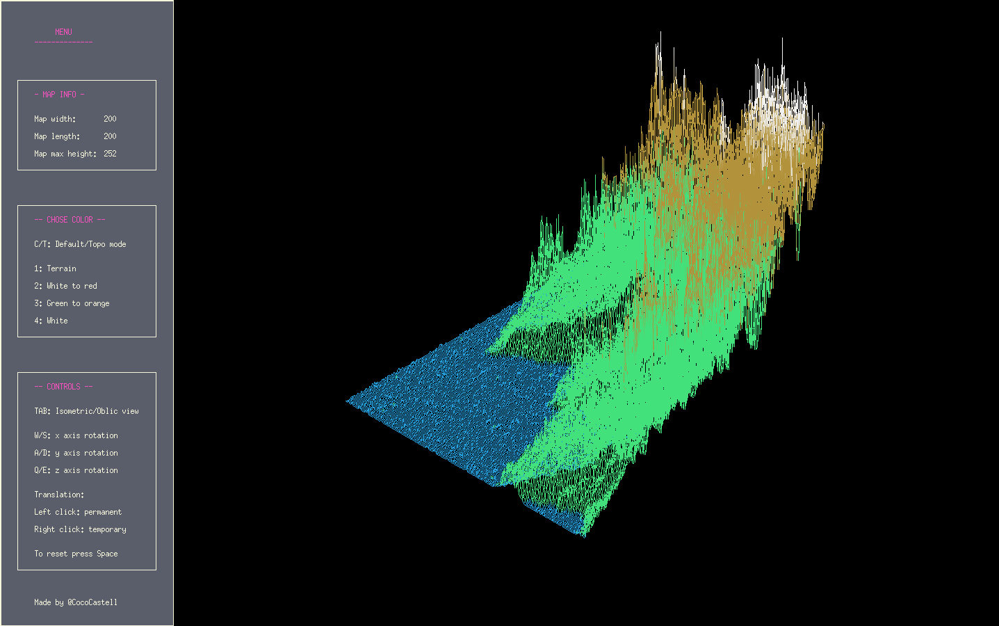

# About Fdf

This project is about representing a landscape as a 3D object in which all  
surfaces are outlined in lines. The use of the graphical library MiniLibX is asked.  

# How to run

First compile in the directory with  
'''bash
'make'

Then execute the programm with one map argument  
'./fdf test_maps/pyramid.fdf'

# Implementation

- MiniLibX tools.

- Breshenham algorithm to draw the lines.

- Isometric and oblic view algorithm.

- 2 types of gradient: one continue from both hight extremities and the other one
  changing color when reaching a new level. I used linear interpolation.

- Trigonometric functions for rotations.

- Temporary and permanent translation.

- Menu and different color themes.

# Grade

125/100

# Results

  

 

# Ressources

https://www.youtube.com/watch?v=CceepU1vIKo  
https://harm-smits.github.io/42docs/libs/minilibx

